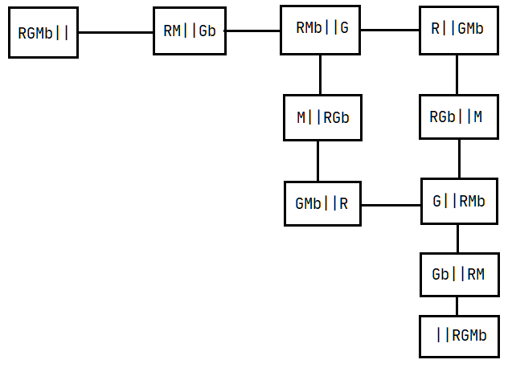
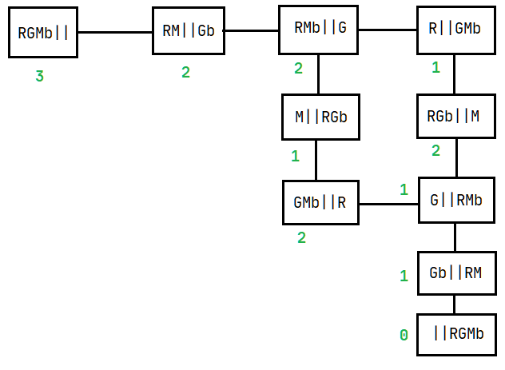
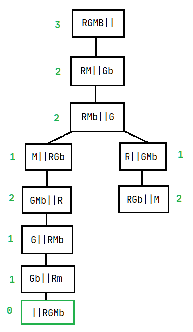

**1. a)**



**b)** An admissible heuristic could be the number of things on the left side of the river. This heuristic is always admissible since the peasant can only transport one thing at a time, so even without the other restrictions imposed by the problem, he would need 2n crossings to transport n things.



**c)** The solution found, with a cost of 7 crossings is `RGMB|| -> RM||Gb -> RMb||G -> M||RGb -> GMb||R -> G||RMb -> Gb||RM -> ||RGMb`.



**2. a)** Since a machine can only produce one part at a time, the total cost is: ✔️
```
C(S1) = max(10 + 7 + 8, 11 + 12) = max(25, 23) = 25
```

**b)** The successor picked by the steepest ascent hill-climbing algorithm will be N2 or N6, depending on the order the successors are generated in. ✔️
```
Successors of S1
----------------
N1 {A-M2, B-M1, C-M2, D-M2, E-M1} (cost 33)
N2 {A-M1, B-M3, C-M2, D-M2, E-M1} (cost 23)
N3 {A-M1, B-M1, C-M3, D-M2, E-M1} (cost 25)
N4 {A-M1, B-M1, C-M2, D-M3, E-M1} (cost 25)
N5 {A-M1, B-M1, C-M2, D-M2, E-M2} (cost 31)
N6 {A-M1, B-M1, C-M2, D-M2, E-M3} (cost 23)
```

**c)** ✔️
```
N1 is generated (cost 33)
delta = 25 - 33 = -8
prob = e^(delta / T) = e^(-0.8) = 0.449 < 0.55

Therefore N1 is not accepted

N2 is generated (cost 23)
Cost is lower than S1, therefore it is accepted
```

**3. a)** `E(S) = -(3/8) * log2(3/8) -(5/8) * log2(5/8) = 0.954` ✔️  
**b)** ✔️
```
Hair
----
Blonde - 2S 2N
Brown - 0S 3N
Red - 1S 0N

Entropy(Hair) = 0.5 * (-0.5 * log2(0.5) -0.5 * log2(0.5)) 
                + 0.375 * 0 
                + 0.125 * 0
              = 0.5

Height
------
Average - 2S 1N
Tall - 0S 2N
Short - 1S 2N

Entropy(Height) = 0.375 * (-(2/3) * log2(2/3) -(1/3) * log2(1/3))
                  + 0.25 * 0
                  + 0.375 * (-(1/3) * log2(1/3) -(2/3) * log2(2/3))
                = 0.689

Weight
------
Light - 1S 1N
Average - 1S 2N
Heavy - 1S 2N

Entropy(Weight) = 0.25 * (-0.5 * log2(0.5) - 0.5 * log2(0.5))
                  + 0.375 * (-(1/3) * log2(1/3) -(2/3) * log2(2/3))
                  + 0.375 * (-(1/3) * log2(1/3) -(2/3) * log2(2/3))
                = 0.939

Lotion
------
No - 3S 2N
Yes - 0S 3N

Entropy(Lotion) = 0.625 * (-0.6 * log2(0.6) - 0.4 * log2(0.4))
                  + 0.375 * 0
                = 0.607

Therefore the ID3 algorithm would place the Hair attribute in the root of the decision tree.
```
**c)** ✔️
```
Hair
----
Blonde - 4
Brown - 3
Red - 1

Split Info = -(0.5 * log2(0.5) + 0.375 * log2(0.375) + 0.125 * log2(0.125)) = 1.405
Gain Ratio = (0.954 - 0.5) / 1.405 = 0.323

Height
------
Average - 3
Tall - 2
Short - 3

Split Info = -(0.375 * log2(0.375) + 0.25 * log2(0.25) + 0.375 * log2(0.375)) = 1.561
Gain Ratio = (0.954 - 0.689) / 1.561 = 0.170

Weight
------
Light - 2
Average - 3
Heavy - 3

Split Info = 1.561
Gain Ratio = (0.954 - 0.939) / 1.561 = 0.010

Lotion
------
No - 5
Yes - 3

Split Info = -(0.625 * log2(0.625) + 0.375 * log2(0.375)) = 0.954
Gain Ratio = (0.954 - 0.607) / 0.954 = 0.364

Therefore the C4.5 algorithm would place the Lotion attribute in the root of the tree.
```
**d)**
```
No - 3S 2N
Yes - 0S 3N

Error(No) = 1 - max(0.6, 0.4) = 1 - 0.6 = 0.4
Error(Yes) = 1 - max(0.0, 1.0) = 1 - 1.0 = 0.0
```

**4. a)** Since the branching factor is high, breadth first search or iterative deepening should be avoided. Performing a depth first search with limited depth (where the depth limit is equal to the maximum depth of a solution) allows us to find a solution much faster, since when we reach that maximum depth, we know for sure that the solution cannot be found anywhere in that branch, and we can switch to an earlier branch of the search tree. ✔️  
**b)** The best admissible heuristic based on `h` is given by `h / 1.1`. This function will at most, match the real cost (when the `h` function exceeds it by 10%), and will never exceed it. ✔️  
**d)** ✔️
```
P(C1) = 10/82 = 12.2%
P(C2) = 15/82 = 18.3%
P(C3) = 27/82 = 32.9%
P(C4) = 30/82 = 36.6%
```
**e)** The nodes `9, 1, 7` would be cut.
