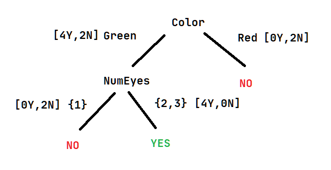
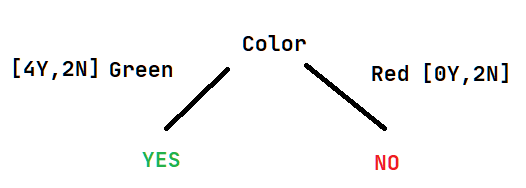

**1. a)**

**Breadth first search**
```
- I
    - A
        - [F1]
    - B
    - C
```
**Greedy search**
```
- I
    - B (h = 1)
    - C (h = 3)
        - [F3] (h = 0)
```
**A\***
```
- I
    - B (1 + 1 = 2)
        - C (3 + 3 = 6)
        - H (3 + 5 = 8)
            - D (4 + 4 = 8)
                - B (8 + 1 = 9)
                - [F2] (9 + 0 = 9)
    - C (5 + 3 = 8)
```

**b)** The heuristic is admissible since it never overestimates the cost of reaching the goal, that is, at every node, the estimated cost is less than or equal to the cost of the shortest path to a goal node. ✔️
```
h -> heuristic
csp -> cost of shortest path

I: h = 8, csp = 9
A: h = 9, csp = 9
E: h = 1, csp = 2
F1: h = 0, csp = 0
D: h = 4, csp = 5
B: h = 1, csp = 8
C: h = 3, csp = 11
H: h = 5, csp = 6
F2: h = 0, csp = 0
F3: h = 0, csp = 0
```

**c)** Only the A* search finds the optimal path (`I -> B -> H -> D -> F2`, with cost 9), both breadth first search (`I -> A -> F1`, cost 13) and greedy search (`I -> C -> F3`, cost 16) find suboptimal solutions.

**3. a)** `E(S) = -(0.5 * log2(0.5) + 0.5 * log2(0.5)) = 1.0` ✔️  
**b)** ✔️
```
Split Infos
-----------
Shape = -(0.625 * log2(0.625) + 0.375 * log2(0.375)) = 0.954
Color = -(0.75 * log2(0.75) + 0.25 * log2(0.25)) = 0.811
NumEyes = -(0.25 * log2(0.25) + 0.25 * log2(0.25) + 0.5 * log2(0.5)) = 1.5

Gain Ratios
-----------
Shape = (1 - 0.951) / 0.954 = 0.051
Color = (1 - 0.688) / 0.811 = 0.385
NumEyes = (1- 0.655) / 1.5 = 0.230

Therefore the Color attribute would be placed at the root of the decision tree.
```
**c)** ✔️



By using a `{1}, {2, 3}` split for the NumEyes attribute, we can classify all aliens correctly.

**d)** ✔️



```
Error ratios
------------
Color -> Green: (2 + 1) / (6 + 2) = 0.375
Color -> Red: (0 + 1) / (2 + 2) = 0.25
```