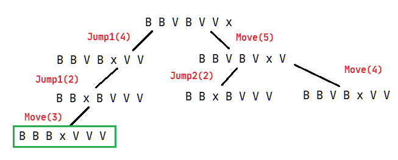

**1.1.**

**State representation**  
List of length 7 where -1 represents a white piece, 0 represents an empty space and 1 represents a red piece.

**Initial state**
```
[1, 1, 1, 0, -1, -1, -1]
```

**Objective test**
```
function objective(state):
    for i in [0, 1, 2]:
        if state[i] != -1:
            return False
    
    for i in [4, 5, 6]:
        if state[i] != 1:
            return False
    
    return True
```

**Operators**  
Since red pieces (represented by 1) can only move right and white pieces (represented by -1) can only move left, we can use the piece representation as the movement direction when calculating the index of the list the piece will move to.

Name|Preconditions|Effects|Cost
----|-------------|-------|----
Move(pos)|`state[pos] != 0 && state[pos + state[pos]] == 0`|`state[pos + state[pos]] = state[pos]`<br>`state[pos] = 0`|1
Jump1(pos)|`state[pos] != 0 && state[pos + 2 * state[pos]] == 0`|`state[pos + 2 * state[pos]] = state[pos]`<br>`state[pos] = 0`|2
Jump2(pos)|`state[pos] != 0 && state[pos + 3 * state[pos]] == 0`|`state[pos + 3 * state[pos]] = state[pos]`<br>`state[pos] = 0`|2

**1.2.** TODO

**1.3.** A better heuristic for the A* algorithm can be given by the expression 6 - number of red pieces in cells 5, 6 and 7 - number of white pieces in cells 1, 2 and 3, since it also guides the search towards the state where the empty space is in cell 4.
```
function heuristic(state):
    sum_white = 0
    sum_red = 0

    for i in [0, 1, 2]:
        if state[i] == 1:
            sum_white += 1
    
    for i in [4, 5, 6]:
        if state[i] == -1:
            sum_red += 1
    
    return 6 - sum_white - sum_red
```

**1.4. a)** ✔️

 

**b)** ✔️



**2.1.**

**Problem representation**  
An input file for this problem could contain the coordinates of the clients and the second factory, considering a cartesian coordinates system where the origin is the first factory. An example input file could be:
```
5 3
2 2
10 4
4 7
9 3
```
This means that there are four clients at coordinates `(5, 3)`, `(2, 2)`, `(10, 4)` and `(4, 7)` and the second factory is located at coordinates `(9, 3)`.

**Solution representation**  
The solution could be represented as a sequence of numbers which define the order the clients would be visited in. For example, the solution `[4, 2, 1, 3]` corresponds to the route `Factory 1 -> Client 4 -> Client 2 -> Client 1 -> Client 3 -> Factory2`.

**Evaluation function**  
In order to obtain the most efficient route, we are looking for the minimum value of the `eval` function, which returns the total distance travelled for a given route.

```
function distance(pos1, pos2):
    // Straight line distance between two points
    return sqrt(pow(pos2[0] - pos1[0], 2) + pow(pos2[1] - pos1[1], 2))

function eval(route):
    global factory1_pos, factory2_pos, client_pos

    total = distance(factory1_pos, client_pos[route[0]])

    for i = 0 to (route.length - 2):
        total += distance(client_pos[route[i]], client_pos[route[i + 1]])
    
    total += distance(client_pos[route[route.length - 1]], factory2_pos)

    return total
```

**2.2.** A simple neighbourhood function could swap the position of two random clients in the sequence. The pseudocode for such a function is as follows:
```
function neighbourhood(sol):
    c1 = rand(0, sol.length - 1)
    c2 = rand(0, sol.length - 2)

    if c2 >= c1:
        c2 += 1
    
    new_sol = copy(sol)

    temp = new_sol[c1]
    new_sol[c1] = new_sol[c2]
    new_sol[c2] = temp

    return new_sol
```

**3.2.** If all solutions have different costs, we can conclude that there is only one solution with the minimum cost. Therefore both uniform cost search and A* with an acceptable heuristic will find the same solution (since both of these algorithms find the optimal solution). However, if the heuristic used for the A* algorithm is good, it will be more efficient than uniform cost search. ✔️

**3.3. a)** C ✔️  
**b)** E ✔️  
**c)** D ✔️  
**d)** C ✔️  
**e)** G ✔️

**3.4.** In the minimax algorithm, ordering the nodes by the evaluation function (assuming that it is reasonably good) can reduce the number of nodes that are analysed, since exploring the most promising nodes first can allow the algorithm to prune large sections of the search tree through alpha beta pruning (minimax with alpha beta pruning doesn't explore nodes that cannot improve the current best move). In the best case scenario this can reduce the complexity of the algorithm from `O(b^m)` to `O(b^(m/2))`, where `b` is the average branching factor and `m` is the search depth. ✔️

**3.5. a)** ✔️
```
A = 8
B = 3
C <= 1
D = 8
```
**b)** The nodes `O, Q, T, U, Y`. ✔️

**3.6. a)** 10.8%. Since the new solution is worse than the current solution, we need to calculate the probability of accepting it using the delta between solutions and the current temperature. ✔️
```
delta = eval(new) - eval(current) = 18 - 20 = -2
prob = e^(delta / T) = e^(-2 / 0.9) = 0.108 = 10.8%
```
**b)** 100%. Considering that the problem is a minimization problem, a solution with evaluation 18 is better than the current solution, that has evaluation 20. Therefore, the new solution will always be accepted. ✔️

**3.9.** ✔️
```
True Positive: positive test and pregnant (45)
False Negative: negative test and pregnant (5)
False Positive: positive test and not pregnant (20)
True Negative: negative test and not pregnant (30)

Accuracy = (45 + 30) / (45 + 5 + 20 + 30) = 75 / 100 = 75%

Precision = TP / (TP + FP) = 45 / (45 + 20) = 45 / 65 = 69.2%

Recall = TP / (TP + FN) = 45 / (45 + 5) = 45 / 50 = 90%

F-measure = 2 * TP / (2 * TP + FP + FN) = 90 / (90 + 20 + 5) = 90 / 115 = 78.3%
```