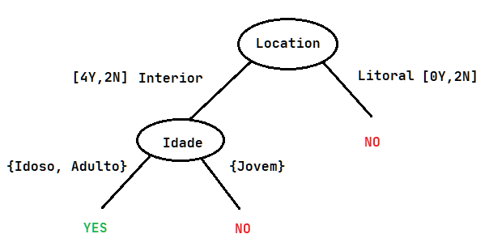

**2.1.** `E(S) = -(0.5 * log2(0.5) + 0.5 * log2(0.5)) = 1.0`  
**2.2.**
```
Split Infos
-----------
Location = -(0.75 * log2(0.75) + 0.25 * log2(0.25)) = 0.811
Sex = -(0.5 * log2(0.5) + 0.5 * log2(0.5)) = 1.0
Age = -(0.25 * log2(0.25) + 0.5 * log2(0.5) + 0.25 * log2(0.25)) = 1.5

Gain Ratios
-----------
Location = (1.0 - 0.688) / 0.811 = 0.385
Sex = (1.0 - 0.951) / 1.0 = 0.049
Age = (1.0 - 0.655) / 1.5 = 0.230

Therefore the Location attribute would be placed at the root of the decision tree.
```
**2.3.** 



**2.4.**


```
Error ratio

Location -> Interior: (2 + 1) / (6 + 2) = 3 / 8 = 0.375
Location -> Litoral: (0 + 1) / (2 + 2) = 1 / 4 = 0.25
```

**3.1.** 


**3.6.**
```
A - 13
B - 1
C - 13
D - <= 8

The nodes M and N are not analyzed.
```

**3.7.**


**3.8.**
```
∀x ∃!y: (bird(x) ∧ eats(x, worms)) ⇒ eats(y, x)
∀x: whale(x) ⇒ mammal(x)
∀x ∃y: (fish(x) ∧ fish(y) ∧ ~(same(species(x), species(y))) => eats(y, x)
```