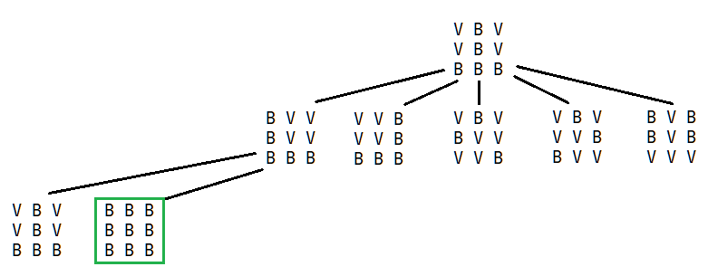
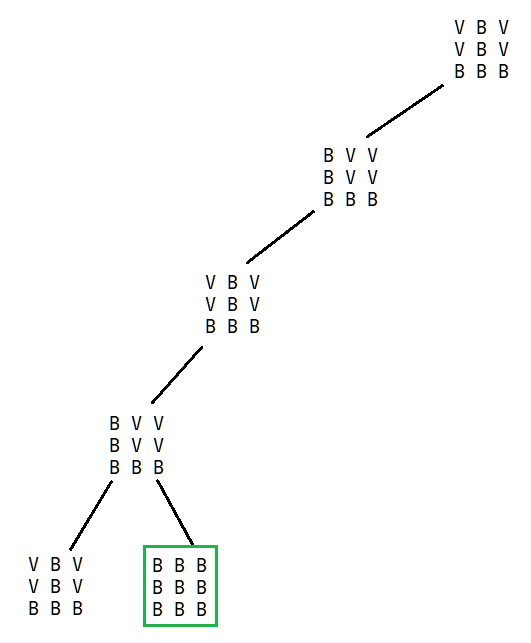

**1.1.**

**State representation**  
3x3 matrix with the numbers -1 (red) or 1 (white) in each position. Using these numbers to represent the double-sided pieces simplifies the process of flipping pieces.

**Initial state**
```
[
    [-1, 1, -1],
    [-1, 1, -1],
    [1, 1, 1]
]
```

**Objective test**  
```
function objective():
    for row in board:
        for piece in row:
            if piece == -1:
                return False
    return True
```

**Operators**
Name|Preconditions|Effects|Cost
----|-------------|-------|----
FlipAll|none|`flipAll`|9
FlipTopLeft|none|`flipTopLeft`|4
FlipTopRight|none|`flipTopRight`|4
FlipBottomLeft|none|`flipBottomLeft`|4
FlipBottomRight|none|`flipBottomRight`|4

```
function flipAll():
    for row in board:
        for piece in row:
            piece = -1 * piece

function flipTopLeft():
    for i in [0, 1]:
        for j in [0, 1]:
            board[i][j] = -1 * board[i][j]

function flipTopRight():
    for i in [0, 1]:
        for j in [1, 2]:
            board[i][j] = -1 * board[i][j]

function flipBottomLeft():
    for i in [1, 2]:
        for j in [0, 1]:
            board[i][j] = -1 * board[i][j]

function flipBottomRight():
    for i in [1, 2]:
        for j in [1, 2]:
            board[i][j] = -1 * board[i][j]
```

**1.2.**

Since at all times there are five possible moves, the average branching factor is 5.  
The dimension of the search space is 2^9 = 512 (for each of the 9 positions there are 2 possible colors). However, some configurations may be unreachable using the operators defined previously.

**1.3.**




**1.4.**

An admissible h(n) function for the A* algorithm could be the number of red pieces. This is an admissible heuristic since it can be thought of as the distance to the game's goal, which is a board with no red pieces.

```
function h():
    count = 0
    for row in board:
        for piece in board:
            if piece == -1:
                count = count + 1
    return count
```

**2.1.** The input files could contain the (x, y) coordinates of each establishment, separated by a space, with one establishment per line. So, an example input file with three establishments could be:
```
4 3
1 1
8 7
```
The solution could be represented by two sequence of numbers that dictate the order the establishments would be visited in for each brigade. For example, in the solution `[3, 1], [2]` the first brigade would visit the third establishment present in the input file, followed by the first establishment. The second brigade would visit the second establishment.

**2.2.** The problem's constraint is, for each brigade, given by `total_visit_time + total_travel_time <= 8 hours`. The optimization criteria that we are trying to maximize is the number of establishments visited. Given the solution representation described in the previous answer, the value of a solution is given by the sum of the lengths of each brigade's sequence.
```
function evaluate(solution):
    total_establishments = 0
    for seq in solution:
        total_establishments += seq.length
    return total_establishments
```

**2.3.**
```
FIRST BRIGADE

total_travel_time = 40 / 20 + 20 / 20 + 10 / 20 + 10 / 20 = 2 + 1 + 0.5 + 0.5 = 4 hours
total_visit_time = 3 hours

total_time = 7 hours <= 8 hours

SECOND BRIGADE

total_travel_time = 30 / 20 + 20 / 20 + 30 / 20 = 1.5 + 1 + 1.5 = 4 hours
total_visit_time = 2 hours

total_time = 6 hours <= 8 hours
```

We can conclude that the solution is valid. It is also an optimal solution since all the establishments are visited.

**2.4.**
```
function neighbourhood(solution):
    global unused

    brigade = rand(0, 1)
    other = brigade == 0 ? 1 : 0

    possible = []
    if unused.length > 0:
        possible.add('Add')
    if solution[brigade].length > 0:
        possible.add('Remove')
    if solution[brigade].length > 0 and solution[other].length > 0:
        possible.add('Swap Between')
    if solution[brigade].length > 1:
        possible.add('Swap )

    r = rand_from(possible)

    new_solution = copy(solution)

    if r == 'Add':
        // Add an establishment

        new_establishment = unused[rand(0, unused.length - 1)]
        unused.remove(new_establishment)
        new_solution[brigade].add(new_establishment)
    else if r == 'Remove':
        // Remove an establishment

        removed = solution[brigade][rand(0, solution[brigade].length - 1)]
        unused.add(removed)
        new_solution[brigade].remove(removed)
    else if r == 'Swap Between':
        // Swap establishment between brigades
    else if r == 'Swap':
        // Swap the order of two establishments in the same brigade
        first = rand(0, solution[brigade].length - 1)
        second = rand(0, solution[brigade].length - 2)

        if second >= first:
            second += 1
        
        first_est = solution[brigade][first]
        second_est = solution[brigade][second]

        solution.brigade.remove_at(first)
        solution.brigade.insert(first, second_est)
        solution.brigade.remove_at(second)
        solution.brigade.insert(second, first_est)
    
    return new_solution
```

Two possible neighbour solutions: `[A, C, B], [D, E]` and `[A, D, C], [B, E]`.

**9.** 
* Performance measure - landing without any damage to the airplane, minimize the discomfort of the passengers
* Environment - airspace, landing track, weather conditions
* Actuators - controls for the airplane's roll, pitch and yaw, throttle controls, wheel controls
* Sensors - altitude sensor, weather information, wind sensor

A simple reactive agent isn't suited to this task, since to perform a successful landing, an agent needs to be able to formulate predictions about how its actions will affect the world, react to unpredictable circumstances and adjust its behaviour based on previous events. When considering that landing a commercial plane poses significant risk to human lives, any autonomous agent must be carefully designed.

**10. a)** ✔️
```
A = 10
B = 2
C = 10
D <= 5
```
**b)** `O, U, X, Y` ✔️

**11.** The statement is true, since the minimax algorithm stores the current best move as it explores the search tree, so we could interrupt the search after a certain time interval and return this move. With good move ordering and alpha beta cuts, the overall quality of the moves would also improve since the most promising moves would get explored first, and the algorithm would spend less time exploring inferior moves. ✔️

**12.**
```

```

**13.** The Wumpus World cannot be solved by a purely reactive agent, since an agent cannot rely simply on the current information provided by its sensors: in order to determine the position of the Wumpus or of the pits, the agents needs to be able to use past information, therefore it needs an internal representation of the world (for example, even if the agent senses a stench or a breeze, any position in the Wumpus World has at least two other adjacent positions, so the agent would not be able to determine the position of the Wumpus or the pit). ✔️

**14.** ✔️
```
1NN - Same class as nearest neighbour

* Ind14 (1, 1, 3) -> Nearest neighbour is Ind13 (1, 1, 1) therefore class = C
* Ind15 (2, 4, 6) -> Nearest neighbour is Ind3 (1, 3, 6) therefore class = B
* Ind16 (5, 9, 9) -> Nearest neighbour is Ind9 (4, 9, 8) therefore class = A

3NN - Weighted average of 3 nearest neighbours (multiplied by 1 / d^2)

* Ind14 (1, 1, 3)
    * Ind13 (1, 1, 1), c = C, d^2 = 4
    * Ind3 (2, 2, 5), C = B, d^2 = 6
    * Ind8 (1, 3, 5), C = B, d^2 = 8

C -> 1/4
B -> 1/6 + 1/8 > 1/4

Therefore class = B

* Ind15 (2, 4, 6)
    * Ind4 (1, 3, 6), c = B, d^2 = 2
    * Ind8 (1, 3, 5), c = B, d^2 = 3
    * Ind3 (2, 2, 5), c = B, d^2 = 5

Therefore class = B

* Ind16 (5, 9, 9)
    * Ind9 (4, 9, 8), c = A, d^2 = 2
    * Ind1 (3, 8, 9), c = A, d^2 = 5
    * Ind2 (4, 7, 8), c = A, d^2 = 6

Therefore class = A
```

**15.** 
```py
import pandas as pd
from sklearn.neighbors import KNeighborsClassifier
from sklearn.svm import SVC
from sklearn.model_selection import cross_val_score

df = pd.read_csv('data.csv')

X, y = df[['dimension', 'location', 'year_of_construction', 'finishing_type']], df['sale_type']

knn = KNeighborsClassifier()
print(cross_val_score(knn, X, y, cv=10, scoring=['accuracy', 'precision', 'recall', 'f1']))

svc = SVC()
print(cross_val_score(svc, X, y, cv=10, scoring=['accuracy', 'precision', 'recall', 'f1']))
```

**16.** ✔️
```
P(B) = pow(e, 5 / 0.5) / (pow(e, 5 / 0.5) + pow(e, 5 / 0.5) + pow(e, 1 / 0.5) + pow(e, 6 / 0.5))
     = 0.1065
     = 10.65%
```

**17.** ✔️
```
The 'de' word appeares 5 times in the text.
The text has a total of 31 words, with  27 distinct words.

P = (5 + 1) / (31 + 27) = 10.34%
```